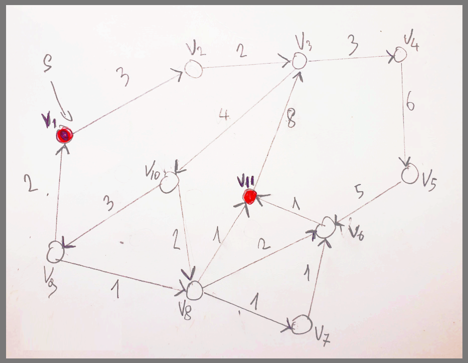
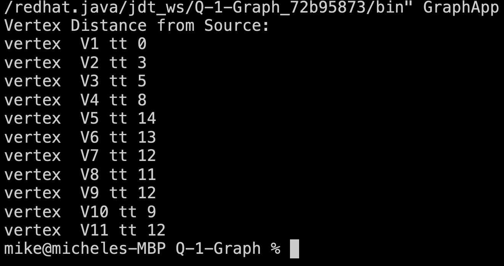

# Shortest path application

This repo contains a client / server application which implements socket communication.

# Description

This application determines the shortest path from an assumed source `V1` to destination `V11` by using Dijkstra’s Algorithm.

An adjacency matrix is use to reppresents the sample graph.

```java
    int graphWeights[][] = new int[][] {
    /*V1*/{ 0, 3, 0, 0, 0, 0, 0, 0, 0, 0, 0 },
    /*V2*/{ 0, 0, 2, 0, 0, 0, 0, 0, 0, 0, 0 },
    /*V3*/{ 0, 0, 0, 3, 0, 0, 0, 0, 0, 4, 0 },
    /*V4*/{ 0, 0, 0, 0, 6, 0, 0, 0, 0, 0, 0 },
    /*V5*/{ 0, 0, 0, 0, 0, 5, 0, 0, 0, 0, 0 },
    /*V6*/{ 0, 0, 0, 0, 0, 0, 0, 0, 0, 0, 1 },
    /*V7*/{ 0, 0, 0, 0, 0, 1, 0, 0, 0, 0, 0 },
    /*V8*/{ 0, 0, 0, 0, 0, 2, 1, 0, 0, 0, 1 },
    /*V9*/{ 2, 0, 0, 0, 0, 0, 0, 1, 0, 0, 0 },
    /*V10*/{ 0, 0, 0, 0, 0, 0, 0, 2, 3, 0, 0 },
    /*V11*/{ 0, 0, 8, 0, 0, 0, 0, 0, 0, 0, 0 },
  };

```

```java
/**
 * START:       V1
 * DESTINATION: V11
 *
 * C = { V1 }
 * C = { V1, V2 }
 * C = { V1, V2, V3 }
 * C = { V1, V2, V3, V4 }
 * C = { V1, V2, V3, V10 }
 * C = { V1, V2, V3, V10, V8 }
 * C = { V1, V2, V3, V10, V8, V11 }
 * C = { 00, 03, 02, 004, 02, 001 }
 * D = (  0 + 3 + 2  + 4 + 2  + 1 ) = 12
 *
 */
```

**Sample graph**



# Preview App


